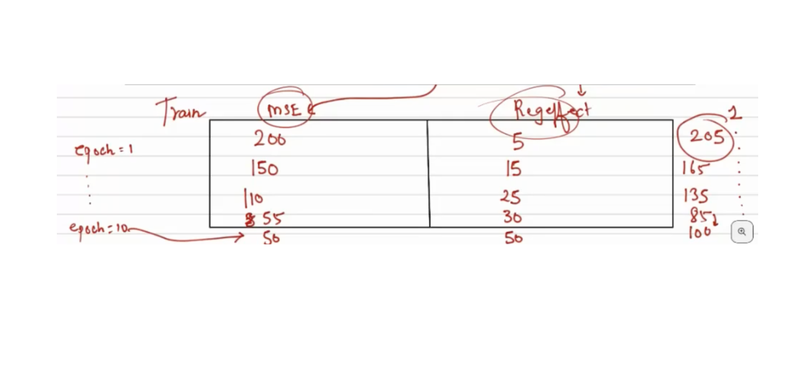

# Overfitting & Underfitting in Neural Networks

Neural networks are prone to **overfitting**.

### Why?

Neural networks are **high-capacity models** — they can learn very complex **patterns**, including **noise** in the training data.

The decision boundary **fits the data too well**. It starts becoming **highly non-linear** to adapt to small fluctuations in the data.

---

### 📈 Causes of Overfitting:
- Too many layers or neurons: High capacity models can learn noise.
- Not enough training data
- Too many training epochs

### 🚨 Signs of Overfitting:
- Low training error, but
- High validation/test error

> We need to make sure that the NN doesn’t fit the noise in the data.

---

Neural networks can also be prone to **underfitting**, though it's less common in practice.

Underfitting happens when a neural network fails to learn the underlying patterns in the data.  
It performs poorly on both the training and test sets.

---

### 🧱 Causes of Underfitting:
- Insufficient training: Not enough epochs
- Model too simple: The architecture has too few layers or neurons

### 🛑 Signs of Underfitting:
- Training Loss → High  
- Validation Loss → High

## Bias-Variance Tradeoff

> It describes the balance between **underfitting** and **overfitting**.

---

| **Term**   | **What it Means**                                      | **Problem It Causes** |
|------------|--------------------------------------------------------|------------------------|
| **Bias**   | Error due to oversimplifying the model                 | Underfitting           |
| **Variance** | Error due to too much sensitivity to training data     | Overfitting            |

---

### 📊 Understanding Variance

- **Variance** refers to how much the model's predictions change when trained on different datasets.
- It’s a property of the **model**, indicating sensitivity to training data.
- **High variance** model: Very sensitive → overfits (fits noise)
- **Low variance** model: More stable → generalizes better

---

### ✅ A Robust Model:
- Has the **best training**, **validation**, and **test** accuracy

---

### ⚙️ Mechanisms to Control Overfitting/Underfitting:
- Control number of **neurons**
- Control number of **layers**
- Choose appropriate **activation functions**
- Select suitable **optimizers**
- Proper **weight initialization**
- Use **regularization**
- Apply **dropout**
- Use **batch normalization**

## Regularization

**Regularization** is a process to **control the variance** of the model and **prevent overfitting** — i.e., avoid fitting to noise in the data.

> It helps the model generalize better to unseen data by discouraging overly complex models.

### Mean Squared Error (MSE) Loss

The **MSE loss** measures the average of the squares of the errors between predicted values and true values:

$$
L = \frac{1}{n} \sum_{i=1}^{n} (y_i - \hat{y}_i)^2
$$

Where:

$L$ → Mean squared error loss  
$n$ → Number of data points  
$y_i$ → Actual value for data point $i$  
$\hat{y}_i$ → Predicted value for data point $i$  

> A smaller MSE indicates better model performance.

### Regularized Loss Function

The regularized loss adds a penalty for large weights to prevent overfitting:

  

Where:

$y_i$ → Actual value  
$\hat{y}_i$ → Predicted value  
$w_j$ → Model weights  
$\lambda$ → Regularization strength (hyperparameter)  
$n$ → Number of data points  
$p$ → Number of weights

> It helps reduce model complexity and overfitting.

**Example:**

> Total loss starts to increase after some time even if the MSE reduces because of the regularization effect. This ensures that the model doesn’t overfit.

