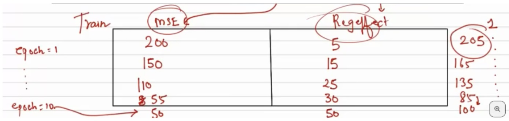

# Overfitting & Underfitting in Neural Networks

Neural networks are prone to **overfitting**.

### Why?

Neural networks are **high-capacity models** — they can learn very complex **patterns**, including **noise** in the training data.

The decision boundary **fits the data too well**. It starts becoming **highly non-linear** to adapt to small fluctuations in the data.

---

### 📈 Causes of Overfitting:
- Too many layers or neurons: High capacity models can learn noise.
- Not enough training data
- Too many training epochs

### 🚨 Signs of Overfitting:
- Low training error, but
- High validation/test error

> We need to make sure that the NN doesn’t fit the noise in the data.

---

Neural networks can also be prone to **underfitting**, though it's less common in practice.

Underfitting happens when a neural network fails to learn the underlying patterns in the data.  
It performs poorly on both the training and test sets.

---

### 🧱 Causes of Underfitting:
- Insufficient training: Not enough epochs
- Model too simple: The architecture has too few layers or neurons

### 🛑 Signs of Underfitting:
- Training Loss → High  
- Validation Loss → High

## Bias-Variance Tradeoff

> It describes the balance between **underfitting** and **overfitting**.

---

| **Term**   | **What it Means**                                      | **Problem It Causes** |
|------------|--------------------------------------------------------|------------------------|
| **Bias**   | Error due to oversimplifying the model                 | Underfitting           |
| **Variance** | Error due to too much sensitivity to training data     | Overfitting            |

---

### 📊 Understanding Variance

- **Variance** refers to how much the model's predictions change when trained on different datasets.
- It’s a property of the **model**, indicating sensitivity to training data.
- **High variance** model: Very sensitive → overfits (fits noise)
- **Low variance** model: More stable → generalizes better

---

### ✅ A Robust Model:
- Has the **best training**, **validation**, and **test** accuracy

---

### ⚙️ Mechanisms to Control Overfitting/Underfitting:
- Control number of **neurons**
- Control number of **layers**
- Choose appropriate **activation functions**
- Select suitable **optimizers**
- Proper **weight initialization**
- Use **regularization**
- Apply **dropout**
- Use **batch normalization**

## Regularization

**Regularization** is a process to **control the variance** of the model and **prevent overfitting** — i.e., avoid fitting to noise in the data.

> It helps the model generalize better to unseen data by discouraging overly complex models.

### Mean Squared Error (MSE) Loss

The **MSE loss** measures the average of the squares of the errors between predicted values and true values:

$$
L = \frac{1}{n} \sum_{i=1}^{n} (y_i - \hat{y}_i)^2
$$

Where:

$L$ → Mean squared error loss  
$n$ → Number of data points  
$y_i$ → Actual value for data point $i$  
$\hat{y}_i$ → Predicted value for data point $i$  

> A smaller MSE indicates better model performance.

### Regularized Loss Function

The regularized loss adds a penalty for large weights to prevent overfitting:

  

Where:

$y_i$ → Actual value  
$\hat{y}_i$ → Predicted value  
$w_j$ → Model weights  
$\lambda$ → Regularization strength (hyperparameter)  
$n$ → Number of data points  
$p$ → Number of weights

> It helps reduce model complexity and overfitting.

**Example:**

> Total loss starts to increase after some time even if the MSE reduces because of the regularization effect. This ensures that the model doesn’t overfit.

## Dropout

### Example:

Imagine a teacher is teaching a class where the front benchers are always answering the questions the teacher asks and they’re learning at a much higher rate than the backbenchers. The backbenchers are not able to understand the concepts.

Now the entire class has to participate as a team in some Olympiad and each student has to perform. So, to improve the process of learning, the teacher starts randomly asking questions so that every student participates and learns.

This is similar to **dropout** in Neural Networks.

In a neural network, the weights are randomly initialized, due to which a few neurons can get higher chances of learning.

For example, here **N2** is overparticipating and the entire information starts flowing through **N2**.

### How Dropout Works in Neural Networks?

During each iteration (forward and backward propagation), we randomly **drop neurons** with a given probability.

For example:

- If the **dropout rate = 0.2** on a dense layer with **5 neurons**,  
  then `0.2 × 5 = 1 neuron` is expected to be dropped (disabled) during each training iteration.

This prevents the network from becoming overly dependent on particular neurons, improving generalization and reducing overfitting.

> ⚠️ Note: During inference (testing/prediction), dropout is **disabled** and all neurons are used.

Dropout is a layer which is applied on top of a dense layer. All neurons from the dense layer can randomly get dropped from the training process. This ensures that the other neurons have to participate.

All the input and output connections of neurons in dropout get deactivated.

Ideally, a dropout layer should be applied after every 2–3 dense layers. Dropout probability is a hyperparameter.

# Batch Normalization

### Types of Gradient Descent

- **Batch Gradient Descent** uses the entire dataset to compute gradients and update weights.  
  *(Batch size = N, where N = number of rows)*

- **Stochastic Gradient Descent (SGD)** uses one sample at a time to compute gradients and update weights.  
  *(Batch size = 1)*

- **Mini-Batch Gradient Descent** uses small batches of data to compute gradients and update weights.  
  *(1 < Batch size < N)*

---

### Example: 1000 Rows

### Total 1000 rows

| **Normal Gradient Descent**                                 | **Mini-Batch Gradient Descent**                                             |
|-------------------------------------------------------------|------------------------------------------------------------------------------|
| 1. Take these 1000 rows, calculate 1000 𝑦̂.                  | 1. Take 100 rows, calculate 100 𝑦̂.                                          |
| 2. Calculate 1000 losses and based on that backpropagate.   | 2. Calculate 100 losses and based on that backpropagate.                    |
|                                                             | 3. Do the step again for another 100 rows (at random).                      |
|                                                             | 4. ... . . 10 times                                                |
| **1 epoch = 1 update**                                      | **1 epoch = 10 updates**                                                    |

> Every time the batch selection is random.

---

### How Does It Work?

Let’s say you have 1000 rows (examples) in your dataset:

1. Take a small batch — e.g., 100 rows  
2. **Forward pass**: Calculate 100 predictions (𝑦̂)  
3. **Loss calculation**: Compute loss for these 100  
4. **Backpropagation**: Update weights based on this batch  
5. **Repeat**: Pick the next batch of 100 (randomly)  
6. Do this for all 10 batches (since 1000 ÷ 100 = 10)

---

### How Does It Help?

Weights get updated after the **1st batch**, so when the **2nd batch** comes, it starts with better weights than random ones.  
This process continues and improves weights across batches.
